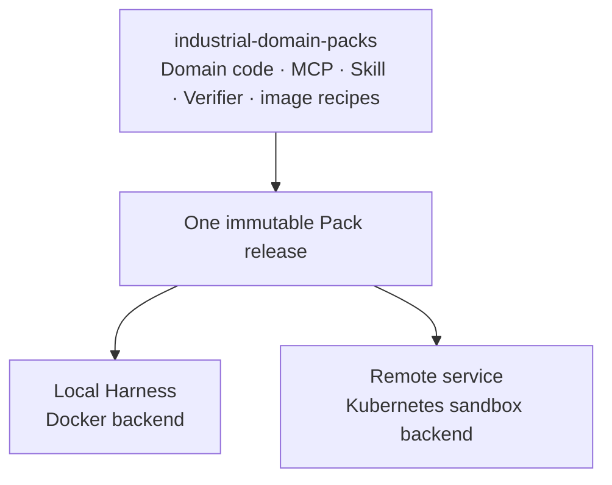

# Domain Pack architecture

This public repository owns domain implementations and their releases. Both local and remote execution consume one Pack identity. Industrial Agent Harness owns canonical contracts and the generic industrial Runtime; the remote service owns execution location, authorization and bounded capacity.

Domain input validation, command preparation, evidence collection and verification must be shared. Backend adapters own process/container startup, cancellation, actual CPU/memory limits and confirmed cleanup. The sandbox backend executes within an allocated Pod and has no nested Docker dependency or control socket. That backend is planned; the imported EDA Runtime still contains its local/Docker implementation.

Domain-specific canonical ToolDescriptors and Verifiers move here together with their native implementation. They continue to use Harness-owned contracts. Native EDA records may be retained as attributed execution evidence; canonical Run, Action, Verification, State and Checkpoint are committed by the outer industrial Runtime. A process exit or raw MCP response does not create engineering acceptance.

The first shared profile is small RTL verification on Linux amd64. Remote qualification retains the existing fixed two-sandbox CPU budget. Capability disclosure must match a qualified profile; a raw 25-tool MCP server does not imply all operations are available on the CPU trial.

Remote-mode clients install trusted metadata, Skills and Viewer declarations, plus the thin client. They do not install the Pack's native Python execution environment. Metadata discovery never permits arbitrary executable code to be loaded from an untrusted service.
